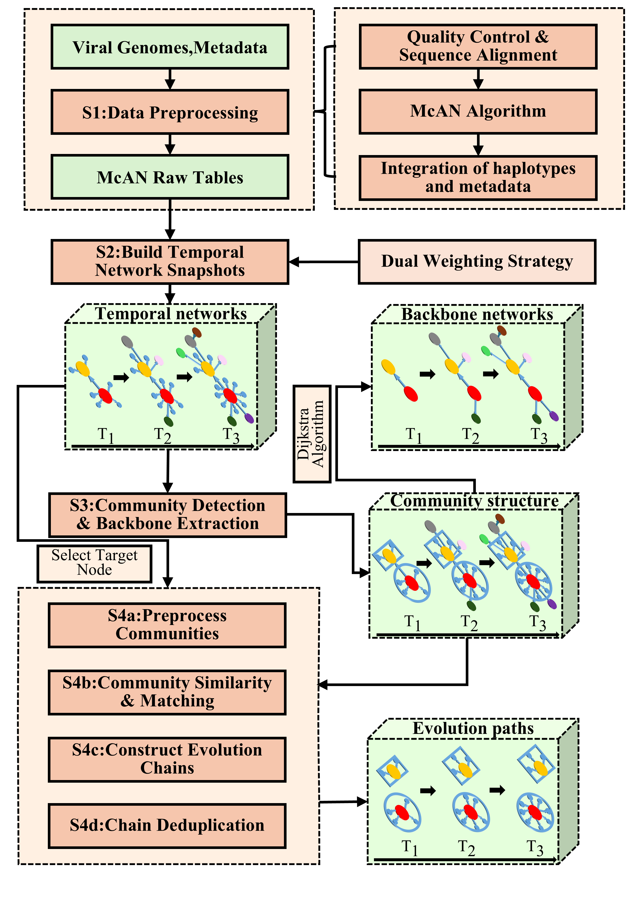

# TempSnap-Trace: Temporal Haplotype Network Analysis Pipeline

## Overview

TempSnap-Trace is a Python-based pipeline for the dynamic analysis of viral evolution using temporal haplotype networks. It processes raw sequence data and metadata to construct time-resolved evolutionary networks, detect communities, extract evolutionary backbones, and track specific community evolution chains over time. The pipeline is modular and leverages parallel processing to handle large datasets efficiently.

<p align="center">
  
  <br>
  <em>Figure 1. The schematic of the TempSnap-Trace algorithm.</em>
</p>

The core workflow consists of the following steps:

1.  **Raw Data Processing (`rawdata`):** Filters and aligns sequences, identifies variants, and integrates metadata.
2.  **McAN Table Generation (`mcantables`):** Runs McAN simulations to infer ancestor-descendant relationships for haplotypes across time intervals.
3.  **Temporal Network Construction (`networks`):** Builds weighted, directed graphs for each time snapshot from McAN results.
4.  **Community Detection & Backbone Extraction (`community`):** Applies Infomap to find communities and extracts the evolutionary backbone.
5.  **Community Evolution Tracking (`Trace` module):** Traces the temporal evolution of specific communities of interest.

Steps 1-4 are orchestrated by `main.py`, while step 5 is performed by the `Trace.py` module.

## Prerequisites

### Software

*   **Python:** Version 3.13.4.
*   **External Tools:**
    *   **halign4:** Required for the `rawdata` step. Must be in the system's PATH.
    *   **variant_mark_ljj.py:** Required for the `rawdata` step. Must be accessible to the Python interpreter.

### Python Dependencies

Install the required packages using `requirements.txt`:
```bash
pip install -r requirements.txt
```

## Installation

1.  **Clone the repository:**
    ```bash
    git clone https://github.com/Jiajun0413/TempSnap-Trace
    cd TempSnap-Trace # Adjust path as needed
    ```
2.  **Install Python dependencies:**
    ```bash
    pip install -r requirements.txt
    ```

## Usage

The pipeline is primarily controlled via `main.py` for data processing and network construction, and the `Trace.py` module for evolutionary tracking.

### Main Pipeline (`main.py`)

Execute pipeline steps (`rawdata`, `mcantables`, `networks`, `community`) using the `main.py` script.

```bash
python main.py --command <step1> [<step2> ...] [options]
```

**Commands (`--command`):**

*   `all`: (Default) Executes the full pipeline: `rawdata` -> `mcantables` -> `networks` -> `community`.
*   `rawdata`: Processes raw sequence and metadata files.
*   `mcantables`: Generates ancestor-descendant tables using McAN.
*   `networks`: Constructs temporal haplotype networks.
*   `community`: Performs community detection and backbone extraction.

**Key Arguments:**

*   `--output_dir <DIR>`: **(Required)** Directory for all output files.
*   `--input_dir <DIR>`: **(Required for `rawdata`)** Directory with input FASTA and metadata files.
*   `--samples <FILE>`: Path to processed data CSV. Required for `mcantables` if `rawdata` is skipped.
*   `--tables <FILE>`: Path to McAN results HDF5 file. Required for `networks`/`community` if `mcantables` is skipped.
*   `--graphs <FILE>`: Path to temporal graphs HDF5 file. Required for `community` if `networks` is skipped.
*   `--start <DATE>`, `--end <DATE>`: Date range for analysis (e.g., `2020-01-01`). Auto-detected if omitted.
*   `--interval <DAYS>`: Time snapshot interval in days (Default: 7).
*   `--ref <ID>`: Reference sequence ID for alignment (Default: 'EPI_ISL_402125').
*   `--p <N>`: Number of processes for parallel tasks (Default: 4).
*   `--attrs <ATTR> ...`: Additional metadata columns to include as node attributes.

### Community Evolution Tracking (`Trace.py`)

After running the main pipeline, use the `track_community_evolution` function from the `Trace.py` module to analyze the evolution of specific communities. This is typically done in a separate Python script or Jupyter Notebook.

**Function Signature:**

```python
track_community_evolution(partitions, extended_graphs, label_of_interest, tracking_label, ...)
```

**Key Arguments:**

*   `partitions`: List of community partitions from the `community` step.
*   `extended_graphs`: List of temporal graphs from the `networks` step.
*   `label_of_interest`: The specific haplotype `mutation_str` to track.
*   `tracking_label`: The node attribute containing the label (e.g., 'name').
*   `recording_label`: Node attribute for lineage composition analysis (e.g., 'Lineage').
*   `similarity_threshold`: Minimum similarity (0-1) to link communities (Default: 0.4).
*   `output_path`: Path to save the resulting HDF5 file of evolution chains.

## Input and Output

### Input File Formats

*   **Sequence File:** Standard FASTA format (`.fasta`, `.fa`, `.fna`).
*   **Metadata File:** Tabular format (`.tsv`, `.csv`, `.xls`, `.xlsx`) with columns for sequence ID, collection date, and optional fields like lineage, clade, and location.

### Key Output Files

All outputs are saved in the `--output_dir`.

*   **`rawdata` step:**
    *   `*_processed_data_*.csv`: The primary output. A table merging metadata with a canonical `mutation_str` for each unique haplotype. This is the main input for subsequent steps.
*   **`mcantables` step:**
    *   `McAN_raw_results_*.h5`: HDF5 file containing ancestor-descendant data frames for each time snapshot.
*   **`networks` step:**
    *   `Temporal_graphs_*.h5`: HDF5 file containing the list of `igraph.Graph` objects representing the temporal networks.
*   **`community` step:**
    *   `Community_structures_*.h5`: HDF5 file with community partition data.
    *   `Backbone_networks_*.h5`: HDF5 file with the extracted evolutionary backbone graphs.
*   **`Trace` module:**
    *   `tracking_results_*.h5`: HDF5 file containing a list of pandas DataFrames, where each DataFrame is a distinct evolutionary chain.

#### Mutation String (`mutation_str`) Format

The `mutation_str` in `*_processed_data_*.csv` is a semicolon-separated string identifying a haplotype. Each mutation is formatted as follows:
*   **SNP:** `RefPos(SNP:RefBase->QueryBase)` (e.g., `23403(SNP:A->G)`)
*   **Insertion:** `RefPosAfter(Insertion:BaseBefore->BaseBeforeInsertedBases)` (e.g., `11288(Insertion:C->CT)`)
*   **Deletion:** `RefPosAfter(Deletion:BaseBeforeDeletedBases->BaseBefore)` (e.g., `21990(Deletion:CAT->C)`)

## Examples

### `main.py` Pipeline Example

Run the full pipeline from `rawdata` to `community`:
```bash
python main.py \
    --command all \
    --input_dir /path/to/your/data \
    --output_dir /path/to/your/results \
    --start 2020-03-12 \
    --end 2020-12-17 \
    --interval 7 \
    --ref EPI_ISL_402125 \
    --p 8
```

### `Trace` Module Example (in a Python script)

```python
from TempSnap import IOManager
from Trace import track_community_evolution

# Load data generated by the main pipeline
graphs_path = '/path/to/your/results/Temporal_graphs_....h5'
communities_path = '/path/to/your/results/Community_structures_....h5'
graphs = IOManager.load_from_hdf5(graphs_path)
communities = IOManager.load_from_hdf5(communities_path)

# Track a specific haplotype
if communities and graphs:
    tracking_chains = track_community_evolution(
        partitions=communities,
        extended_graphs=graphs,
        label_of_interest='3037(SNP:C->T);14408(SNP:C->T);23403(SNP:A->G)',
        tracking_label='name',
        recording_label='Lineage',
        output_path='/path/to/your/results/tracking_chains.h5'
    )

    if tracking_chains:
        print(f"Found {len(tracking_chains)} evolution chains.")
        # The first chain is tracking_chains[0] (a pandas DataFrame)
```

## Notes

*   **File Paths:** When running steps individually, ensure correct paths to intermediate files (`--samples`, `--tables`, `--graphs`) are provided.
*   **Memory Usage:** The pipeline can be memory-intensive. Adjust the number of processes (`--p`) based on your system's resources.
*   **GPU Usage:** The `Trace` module can optionally use a GPU (via PyTorch) for faster community similarity calculations.
*   **HDF5 Storage:** Results are stored efficiently in HDF5 format. Ensure sufficient disk space.
*   **Logging:** `main.py` logs progress to the console and to `log.txt` in the output directory.

## Citation

If you use TempSnap-Trace in your research, please cite:

*[Insert citation details here: e.g., publication, software DOI, repository link]*